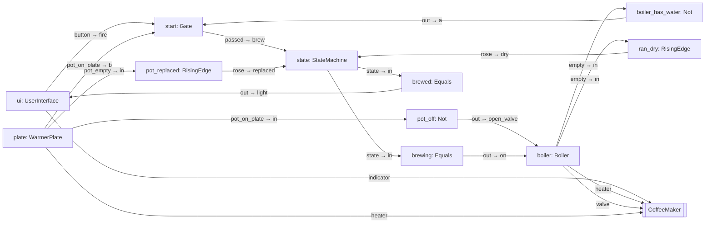

# coffee_maker

```mermaid
flowchart LR
  screen[[CoffeeMaker]]
  ui[ui: UserInterface]
  boiler[boiler: Boiler]
  plate[plate: WarmerPlate]
  state[state: StateMachine]
  start[start: Gate]
  boiler_has_water[boiler_has_water: Not]
  pot_off[pot_off: Not]
  ran_dry[ran_dry: RisingEdge]
  pot_replaced[pot_replaced: RisingEdge]
  brewing[brewing: Equals]
  brewed[brewed: Equals]
  ui -- button → fire --> start
  ui -- indicator --> screen
  boiler -- empty → in --> boiler_has_water
  boiler -- empty → in --> ran_dry
  boiler -- heater --> screen
  boiler -- valve --> screen
  plate -- pot_on_plate → b --> start
  plate -- pot_on_plate → in --> pot_off
  plate -- pot_empty → in --> pot_replaced
  plate -- heater --> screen
  state -- state → in --> brewing
  state -- state → in --> brewed
  start -- passed → brew --> state
  boiler_has_water -- out → a --> start
  pot_off -- out → open_valve --> boiler
  ran_dry -- rose → dry --> state
  pot_replaced -- rose → replaced --> state
  brewing -- out → on --> boiler
  brewed -- out → light --> ui
```
