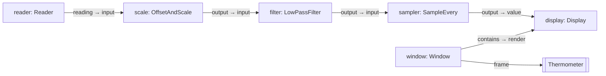

# thermometer

```mermaid
flowchart LR
  screen[[Thermometer]]
  reader[reader: Reader]
  scale[scale: OffsetAndScale]
  filter[filter: LowPassFilter]
  sampler[sampler: SampleEvery]
  display[display: Display]
  window[window: Window]
  reader -- reading → input --> scale
  scale -- output → input --> filter
  filter -- output → input --> sampler
  sampler -- output → value --> display
  window -- contains → render --> display
  window -- frame --> screen
```
