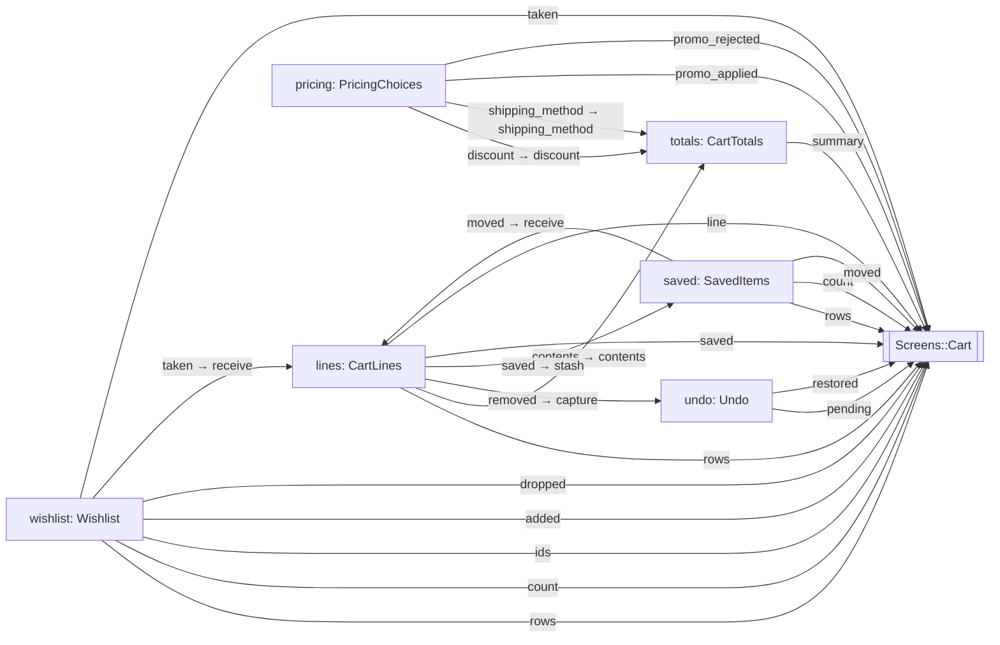

# Screens::Cart

```mermaid
flowchart LR
  screen[[Screens::Cart]]
  lines[lines: CartLines]
  undo[undo: Undo]
  saved[saved: SavedItems]
  wishlist[wishlist: Wishlist]
  pricing[pricing: PricingChoices]
  totals[totals: CartTotals]
  lines -- rows --> screen
  lines -- contents → contents --> totals
  lines -- removed → capture --> undo
  lines -- saved → stash --> saved
  lines -- saved --> screen
  lines -- line --> screen
  undo -- pending --> screen
  undo -- restored --> screen
  saved -- rows --> screen
  saved -- count --> screen
  saved -- moved → receive --> lines
  saved -- moved --> screen
  wishlist -- rows --> screen
  wishlist -- count --> screen
  wishlist -- ids --> screen
  wishlist -- added --> screen
  wishlist -- dropped --> screen
  wishlist -- taken → receive --> lines
  wishlist -- taken --> screen
  pricing -- discount → discount --> totals
  pricing -- shipping_method → shipping_method --> totals
  pricing -- promo_applied --> screen
  pricing -- promo_rejected --> screen
  totals -- summary --> screen
```
