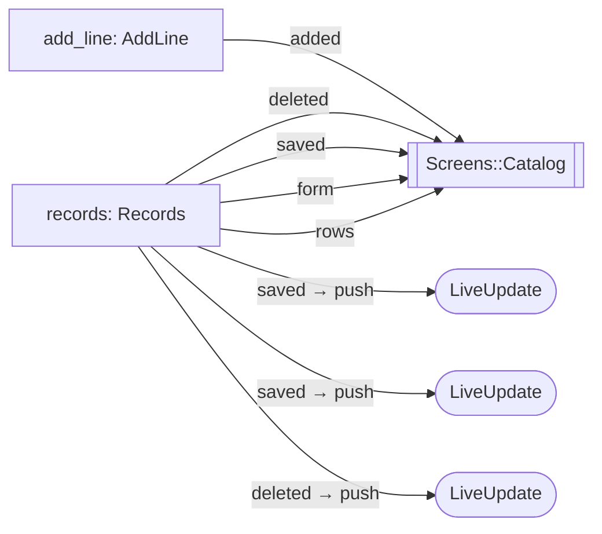

# Screens::Catalog

```mermaid
flowchart LR
  screen[[Screens::Catalog]]
  records[records: Records]
  add_line[add_line: AddLine]
  records -- rows --> screen
  records -- form --> screen
  records -- saved --> screen
  records -- deleted --> screen
  records -- saved → push --> liveupdate_8000([LiveUpdate])
  records -- saved → push --> liveupdate_8008([LiveUpdate])
  records -- deleted → push --> liveupdate_8016([LiveUpdate])
  add_line -- added --> screen
```
