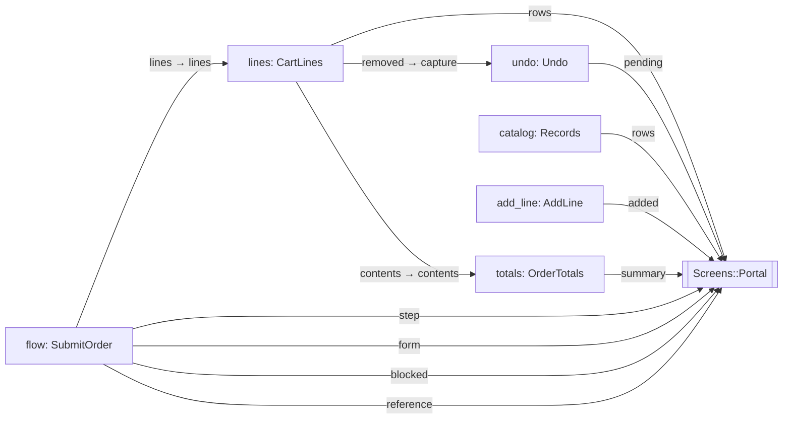

# Screens::Portal

```mermaid
flowchart LR
  screen[[Screens::Portal]]
  lines[lines: CartLines]
  undo[undo: Undo]
  catalog[catalog: Records]
  add_line[add_line: AddLine]
  totals[totals: OrderTotals]
  flow[flow: SubmitOrder]
  lines -- rows --> screen
  lines -- contents → contents --> totals
  lines -- removed → capture --> undo
  undo -- pending --> screen
  catalog -- rows --> screen
  add_line -- added --> screen
  totals -- summary --> screen
  flow -- lines → lines --> lines
  flow -- step --> screen
  flow -- form --> screen
  flow -- blocked --> screen
  flow -- reference --> screen
```
