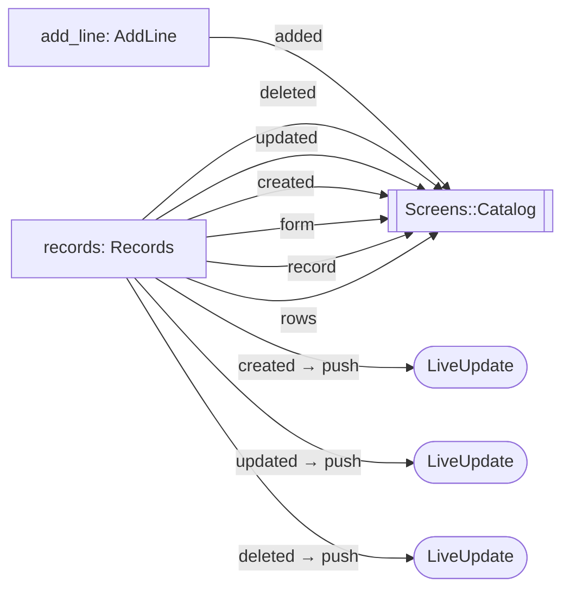

# Screens::Catalog

```mermaid
flowchart LR
  screen[[Screens::Catalog]]
  records[records: Records]
  add_line[add_line: AddLine]
  records -- rows --> screen
  records -- record --> screen
  records -- form --> screen
  records -- created --> screen
  records -- updated --> screen
  records -- deleted --> screen
  records -- created → push --> liveupdate_8024([LiveUpdate])
  records -- updated → push --> liveupdate_8032([LiveUpdate])
  records -- deleted → push --> liveupdate_8040([LiveUpdate])
  add_line -- added --> screen
```
