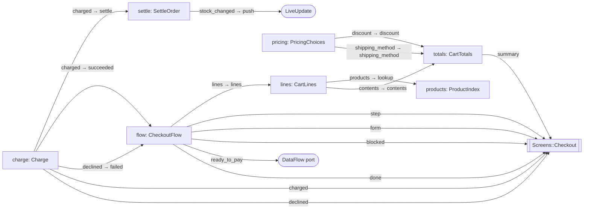

# Screens::Checkout

```mermaid
flowchart LR
  screen[[Screens::Checkout]]
  lines[lines: CartLines]
  pricing[pricing: PricingChoices]
  totals[totals: CartTotals]
  flow[flow: CheckoutFlow]
  charge[charge: Charge]
  settle[settle: SettleOrder]
  products[products: ProductIndex]
  lines -- products → lookup --> products
  lines -- contents → contents --> totals
  pricing -- discount → discount --> totals
  pricing -- shipping_method → shipping_method --> totals
  totals -- summary --> screen
  flow -- lines → lines --> lines
  flow -- step --> screen
  flow -- form --> screen
  flow -- blocked --> screen
  flow -- ready_to_pay --> dataflowport_8240([DataFlow port])
  flow -- done --> screen
  charge -- charged → settle --> settle
  charge -- charged → succeeded --> flow
  charge -- declined → failed --> flow
  charge -- charged --> screen
  charge -- declined --> screen
  settle -- stock_changed → push --> liveupdate_8248([LiveUpdate])
```
