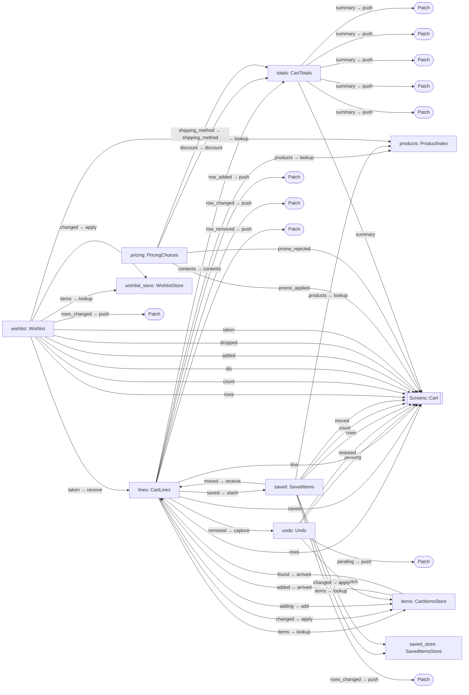

# Screens::Cart

```mermaid
flowchart LR
  screen[[Screens::Cart]]
  lines[lines: CartLines]
  undo[undo: Undo]
  saved[saved: SavedItems]
  wishlist[wishlist: Wishlist]
  pricing[pricing: PricingChoices]
  totals[totals: CartTotals]
  products[products: ProductIndex]
  items[items: CartItemsStore]
  saved_store[saved_store: SavedItemsStore]
  wishlist_store[wishlist_store: WishlistStore]
  lines -- items → lookup --> items
  lines -- products → lookup --> products
  lines -- changed → apply --> items
  lines -- adding → add --> items
  lines -- rows --> screen
  lines -- contents → contents --> totals
  lines -- removed → capture --> undo
  lines -- saved → stash --> saved
  lines -- saved --> screen
  lines -- line --> screen
  lines -- row_added → push --> patch_8152([Patch])
  lines -- row_changed → push --> patch_8160([Patch])
  lines -- row_removed → push --> patch_8168([Patch])
  undo -- pending --> screen
  undo -- pending → push --> patch_8176([Patch])
  undo -- restored --> screen
  undo -- restored → fetch --> items
  saved -- items → lookup --> saved_store
  saved -- products → lookup --> products
  saved -- changed → apply --> saved_store
  saved -- rows --> screen
  saved -- count --> screen
  saved -- rows_changed → push --> patch_8184([Patch])
  saved -- moved → receive --> lines
  saved -- moved --> screen
  wishlist -- items → lookup --> wishlist_store
  wishlist -- products → lookup --> products
  wishlist -- changed → apply --> wishlist_store
  wishlist -- rows --> screen
  wishlist -- count --> screen
  wishlist -- ids --> screen
  wishlist -- rows_changed → push --> patch_8192([Patch])
  wishlist -- added --> screen
  wishlist -- dropped --> screen
  wishlist -- taken → receive --> lines
  wishlist -- taken --> screen
  pricing -- discount → discount --> totals
  pricing -- shipping_method → shipping_method --> totals
  pricing -- promo_applied --> screen
  pricing -- promo_rejected --> screen
  totals -- summary --> screen
  totals -- summary → push --> patch_8200([Patch])
  totals -- summary → push --> patch_8208([Patch])
  totals -- summary → push --> patch_8216([Patch])
  totals -- summary → push --> patch_8224([Patch])
  totals -- summary → push --> patch_8232([Patch])
  items -- added → arrived --> lines
  items -- found → arrived --> lines
```
