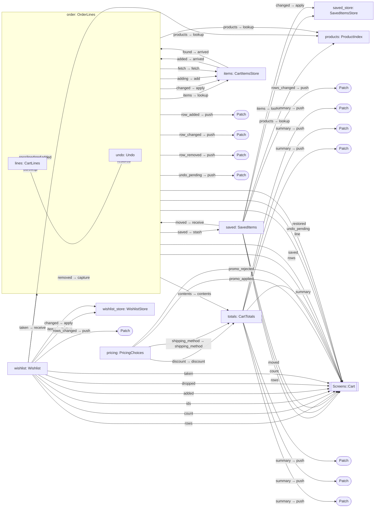

# Screens::Cart

```mermaid
flowchart LR
  screen[[Screens::Cart]]
  subgraph order [order: OrderLines]
  order_lines[lines: CartLines]
  order_undo[undo: Undo]
  end
  saved[saved: SavedItems]
  wishlist[wishlist: Wishlist]
  pricing[pricing: PricingChoices]
  totals[totals: CartTotals]
  products[products: ProductIndex]
  items[items: CartItemsStore]
  saved_store[saved_store: SavedItemsStore]
  wishlist_store[wishlist_store: WishlistStore]
  order -- items → lookup --> items
  order -- products → lookup --> products
  order -- changed → apply --> items
  order -- adding → add --> items
  order -- fetch → fetch --> items
  order -- rows --> screen
  order -- contents → contents --> totals
  order -- saved → stash --> saved
  order -- saved --> screen
  order -- line --> screen
  order -- row_added → push --> patch_8144([Patch])
  order -- row_changed → push --> patch_8152([Patch])
  order -- row_removed → push --> patch_8160([Patch])
  order -- undo_pending --> screen
  order -- undo_pending → push --> patch_8168([Patch])
  order -- restored --> screen
  order_lines -- removed → capture --> order_undo
  order_lines -- items --> order
  order_lines -- products --> order
  order_lines -- changed --> order
  order_lines -- adding --> order
  order_lines -- rows --> order
  order_lines -- row_added --> order
  order_lines -- row_changed --> order
  order_lines -- row_removed --> order
  order_lines -- contents --> order
  order_lines -- saved --> order
  order_lines -- line --> order
  order_undo -- pending --> order
  order_undo -- restored --> order
  saved -- items → lookup --> saved_store
  saved -- products → lookup --> products
  saved -- changed → apply --> saved_store
  saved -- rows --> screen
  saved -- count --> screen
  saved -- rows_changed → push --> patch_8192([Patch])
  saved -- moved → receive --> order
  saved -- moved --> screen
  wishlist -- items → lookup --> wishlist_store
  wishlist -- products → lookup --> products
  wishlist -- changed → apply --> wishlist_store
  wishlist -- rows --> screen
  wishlist -- count --> screen
  wishlist -- ids --> screen
  wishlist -- rows_changed → push --> patch_8200([Patch])
  wishlist -- added --> screen
  wishlist -- dropped --> screen
  wishlist -- taken → receive --> order
  wishlist -- taken --> screen
  pricing -- discount → discount --> totals
  pricing -- shipping_method → shipping_method --> totals
  pricing -- promo_applied --> screen
  pricing -- promo_rejected --> screen
  totals -- summary --> screen
  totals -- summary → push --> patch_8208([Patch])
  totals -- summary → push --> patch_8216([Patch])
  totals -- summary → push --> patch_8224([Patch])
  totals -- summary → push --> patch_8232([Patch])
  totals -- summary → push --> patch_8240([Patch])
  totals -- summary → push --> patch_8248([Patch])
  items -- added → arrived --> order
  items -- found → arrived --> order
```
