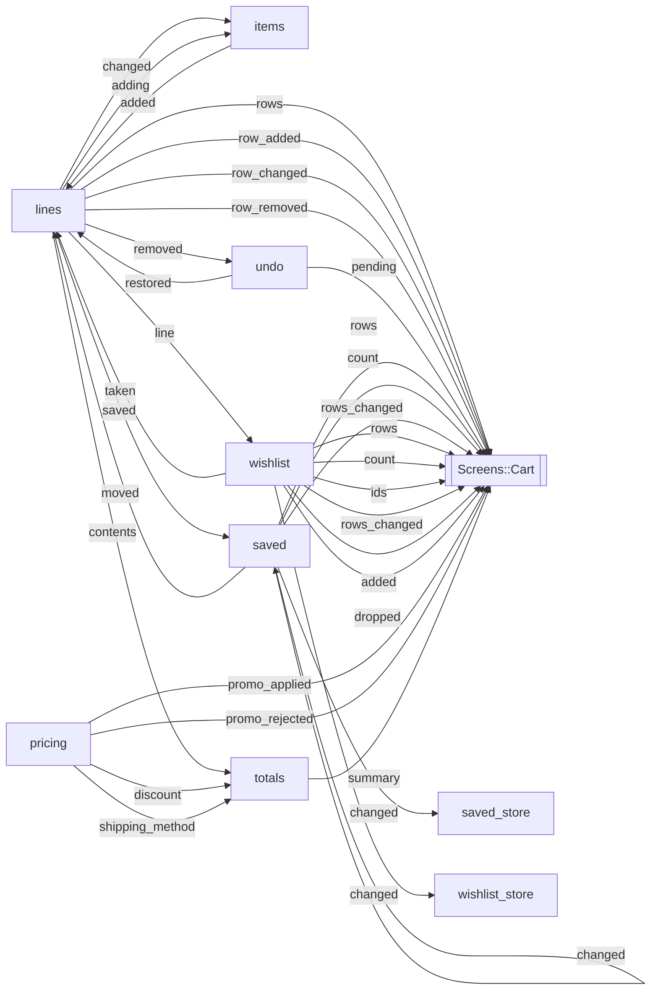

# Screens::Cart

```mermaid
flowchart LR
  screen[[Screens::Cart]]
  lines[lines]
  items[items]
  totals[totals]
  undo[undo]
  saved[saved]
  wishlist[wishlist]
  saved_store[saved_store]
  wishlist_store[wishlist_store]
  pricing[pricing]
  lines -- changed --> items
  lines -- adding --> items
  items -- added --> lines
  lines -- rows --> screen
  lines -- contents --> totals
  lines -- removed --> undo
  lines -- saved --> saved
  lines -- line --> wishlist
  lines -- row_added --> screen
  lines -- row_changed --> screen
  lines -- row_removed --> screen
  undo -- pending --> screen
  undo -- restored --> lines
  saved -- changed --> saved_store
  saved -- changed --> saved
  saved -- rows --> screen
  saved -- count --> screen
  saved -- rows_changed --> screen
  saved -- moved --> lines
  wishlist -- changed --> wishlist_store
  wishlist -- rows --> screen
  wishlist -- count --> screen
  wishlist -- ids --> screen
  wishlist -- rows_changed --> screen
  wishlist -- added --> screen
  wishlist -- dropped --> screen
  wishlist -- taken --> lines
  pricing -- discount --> totals
  pricing -- shipping_method --> totals
  pricing -- promo_applied --> screen
  pricing -- promo_rejected --> screen
  totals -- summary --> screen
```
