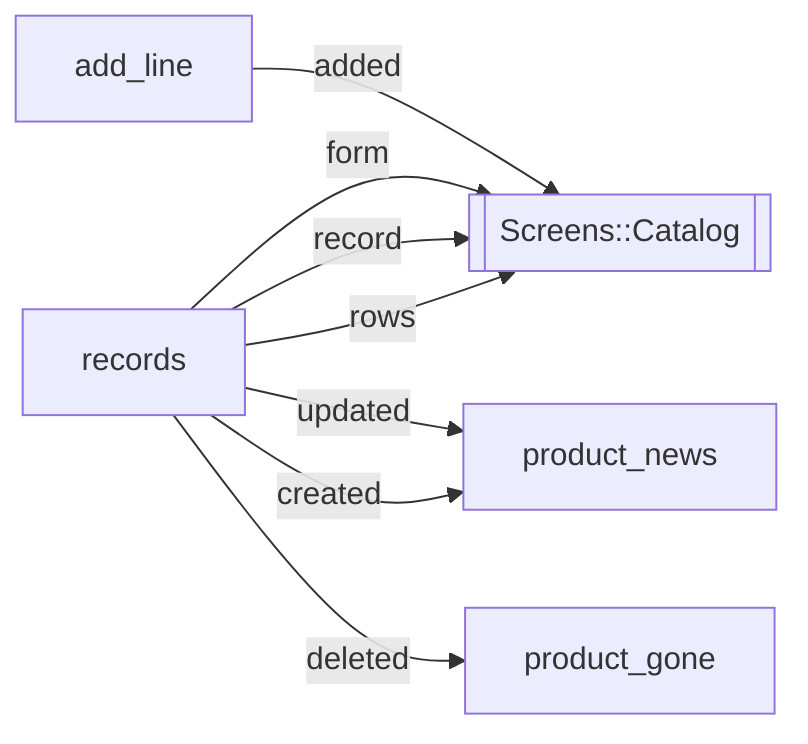

# Screens::Catalog

```mermaid
flowchart LR
  screen[[Screens::Catalog]]
  records[records]
  product_news[product_news]
  product_gone[product_gone]
  add_line[add_line]
  records -- rows --> screen
  records -- record --> screen
  records -- form --> screen
  records -- created --> product_news
  records -- updated --> product_news
  records -- deleted --> product_gone
  add_line -- added --> screen
```
