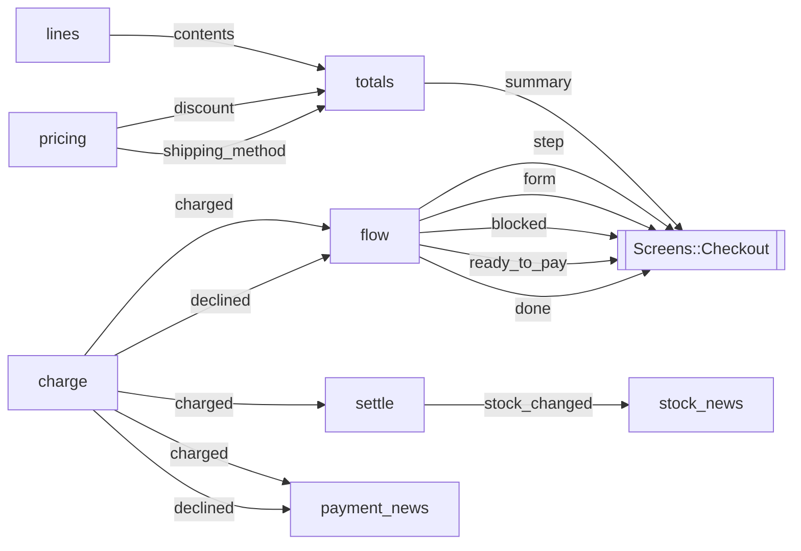

# Screens::Checkout

```mermaid
flowchart LR
  screen[[Screens::Checkout]]
  lines[lines]
  totals[totals]
  pricing[pricing]
  flow[flow]
  charge[charge]
  settle[settle]
  payment_news[payment_news]
  stock_news[stock_news]
  lines -- contents --> totals
  pricing -- discount --> totals
  pricing -- shipping_method --> totals
  totals -- summary --> screen
  flow -- step --> screen
  flow -- form --> screen
  flow -- blocked --> screen
  flow -- ready_to_pay --> screen
  flow -- done --> screen
  charge -- charged --> settle
  charge -- charged --> flow
  charge -- charged --> payment_news
  charge -- declined --> flow
  charge -- declined --> payment_news
  settle -- stock_changed --> stock_news
```
