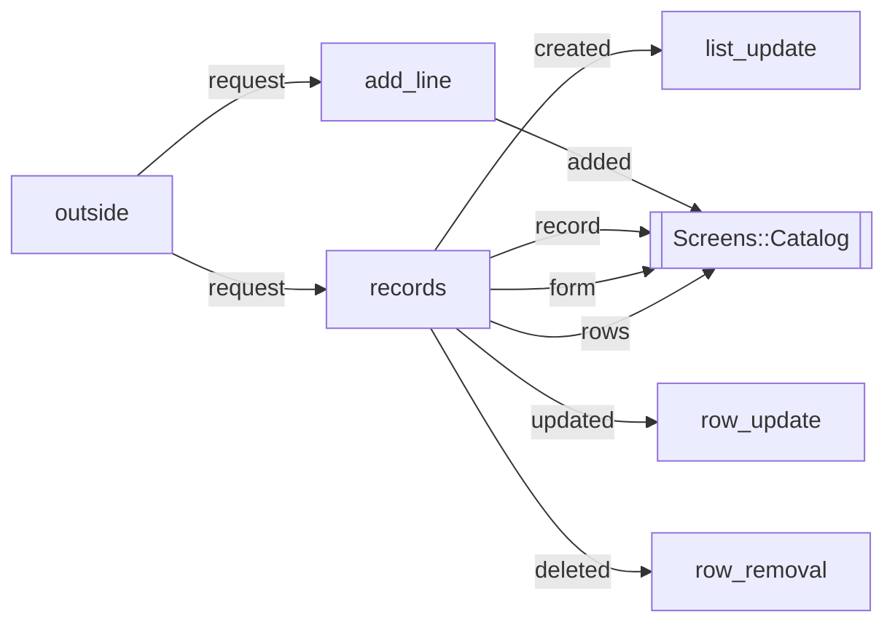

# Screens::Catalog, as it ran

```mermaid
flowchart LR
  screen[[Screens::Catalog]]
  records[records]
  list_update[list_update]
  row_update[row_update]
  row_removal[row_removal]
  add_line[add_line]
  outside -- request --> records
  records -- rows --> screen
  records -- form --> screen
  records -- created --> list_update
  records -- updated --> row_update
  records -- record --> screen
  outside -- request --> add_line
  add_line -- added --> screen
  records -- deleted --> row_removal
```
