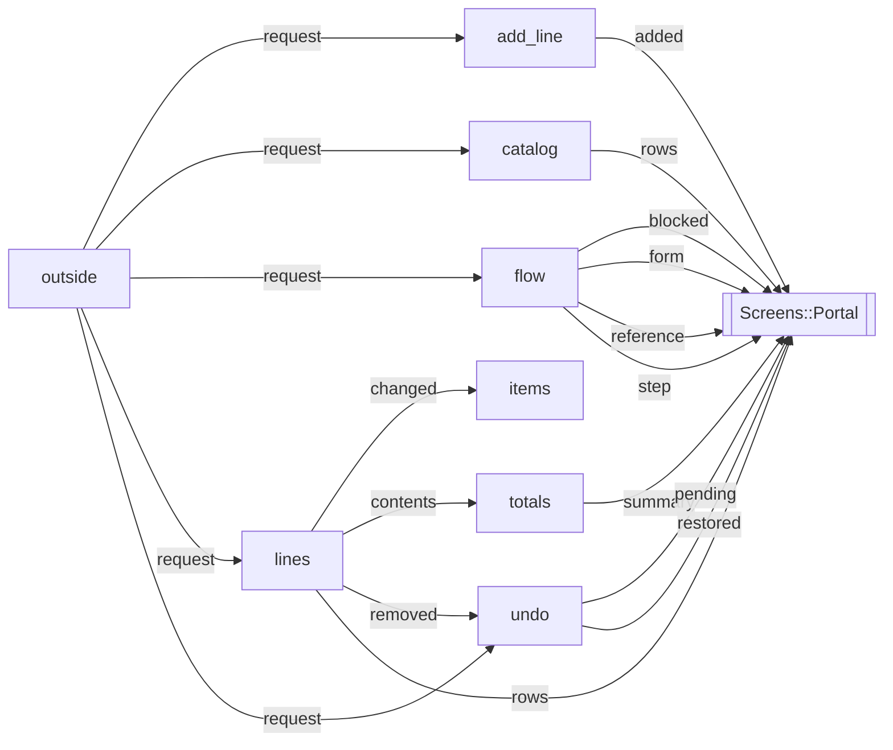

# Screens::Portal, as it ran

```mermaid
flowchart LR
  screen[[Screens::Portal]]
  lines[lines]
  items[items]
  totals[totals]
  undo[undo]
  catalog[catalog]
  add_line[add_line]
  flow[flow]
  outside -- request --> add_line
  outside -- request --> catalog
  outside -- request --> flow
  outside -- request --> lines
  outside -- request --> undo
  add_line -- added --> screen
  catalog -- rows --> screen
  flow -- blocked --> screen
  flow -- form --> screen
  flow -- reference --> screen
  flow -- step --> screen
  lines -- changed --> items
  lines -- contents --> totals
  lines -- removed --> undo
  lines -- rows --> screen
  totals -- summary --> screen
  undo -- pending --> screen
  undo -- restored --> screen
```
