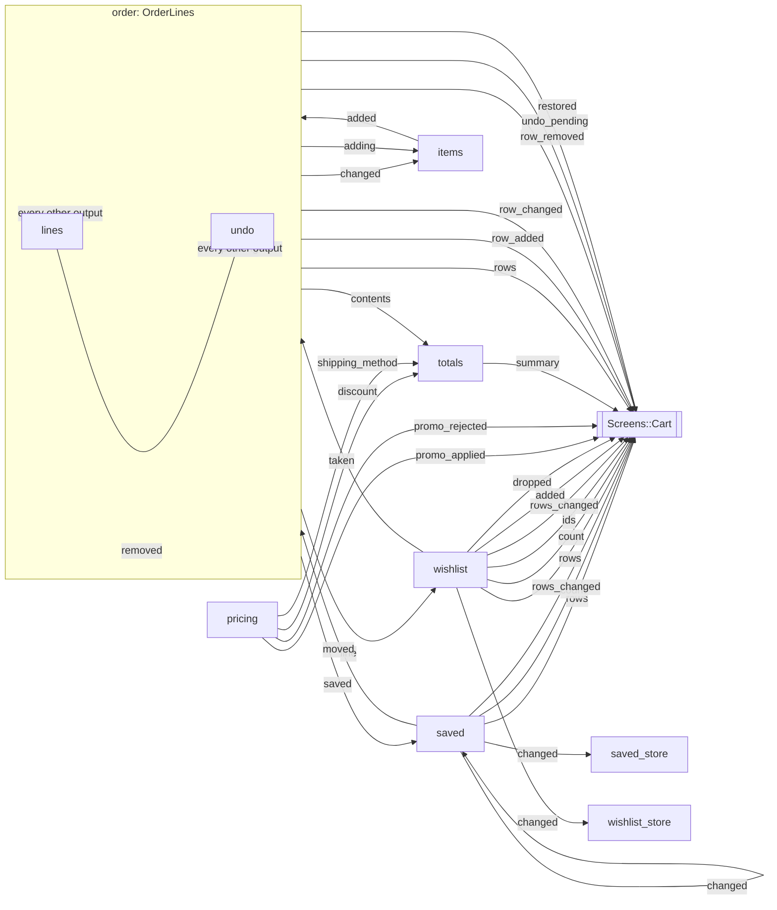

# Screens::Cart

```mermaid
flowchart LR
  screen[[Screens::Cart]]
  subgraph order [order: OrderLines]
  order_lines[lines]
  order_undo[undo]
  end
  saved[saved]
  wishlist[wishlist]
  pricing[pricing]
  totals[totals]
  items[items]
  saved_store[saved_store]
  wishlist_store[wishlist_store]
  order -- changed --> items
  order -- adding --> items
  items -- added --> order
  order -- rows --> screen
  order -- contents --> totals
  order -- saved --> saved
  order -- line --> wishlist
  order -- row_added --> screen
  order -- row_changed --> screen
  order -- row_removed --> screen
  order -- undo_pending --> screen
  order -- restored --> screen
  saved -- changed --> saved_store
  saved -- changed --> saved
  saved -- rows --> screen
  saved -- count --> screen
  saved -- rows_changed --> screen
  saved -- moved --> order
  wishlist -- changed --> wishlist_store
  wishlist -- rows --> screen
  wishlist -- count --> screen
  wishlist -- ids --> screen
  wishlist -- rows_changed --> screen
  wishlist -- added --> screen
  wishlist -- dropped --> screen
  wishlist -- taken --> order
  pricing -- discount --> totals
  pricing -- shipping_method --> totals
  pricing -- promo_applied --> screen
  pricing -- promo_rejected --> screen
  totals -- summary --> screen
  order_lines -- removed --> order_undo
  order_undo -- pending --> order
  order_lines -- every other output --> order
  order_undo -- every other output --> order
```
