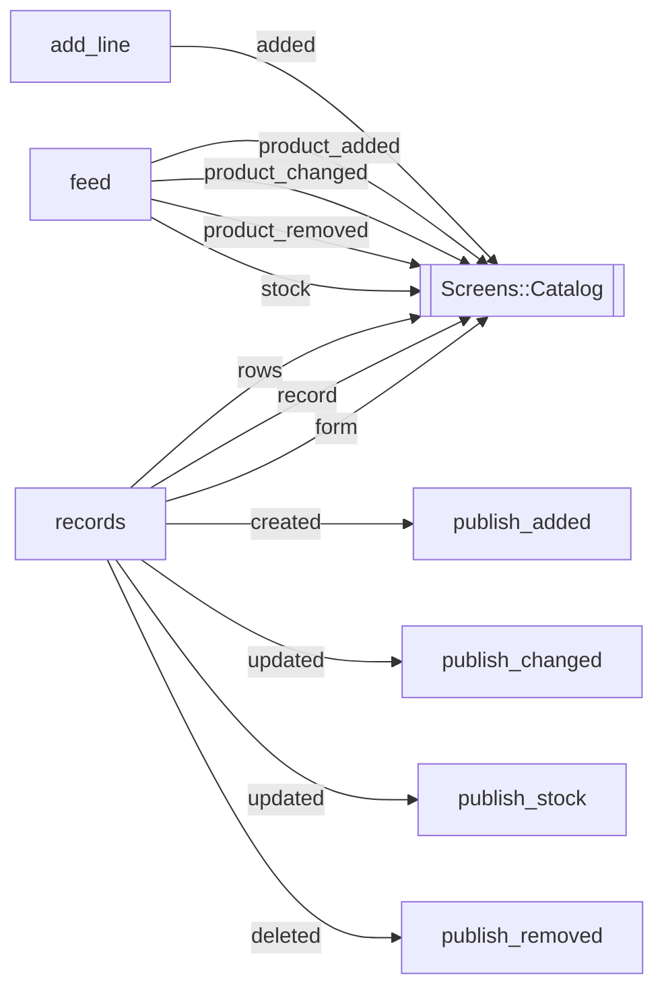

# Screens::Catalog

```mermaid
flowchart LR
  screen[[Screens::Catalog]]
  records[records]
  add_line[add_line]
  feed[feed]
  publish_added[publish_added]
  publish_changed[publish_changed]
  publish_removed[publish_removed]
  publish_stock[publish_stock]
  records -- rows --> screen
  records -- record --> screen
  records -- form --> screen
  records -- created --> publish_added
  records -- updated --> publish_changed
  records -- updated --> publish_stock
  records -- deleted --> publish_removed
  add_line -- added --> screen
  feed -- product_added --> screen
  feed -- product_changed --> screen
  feed -- product_removed --> screen
  feed -- stock --> screen
```
