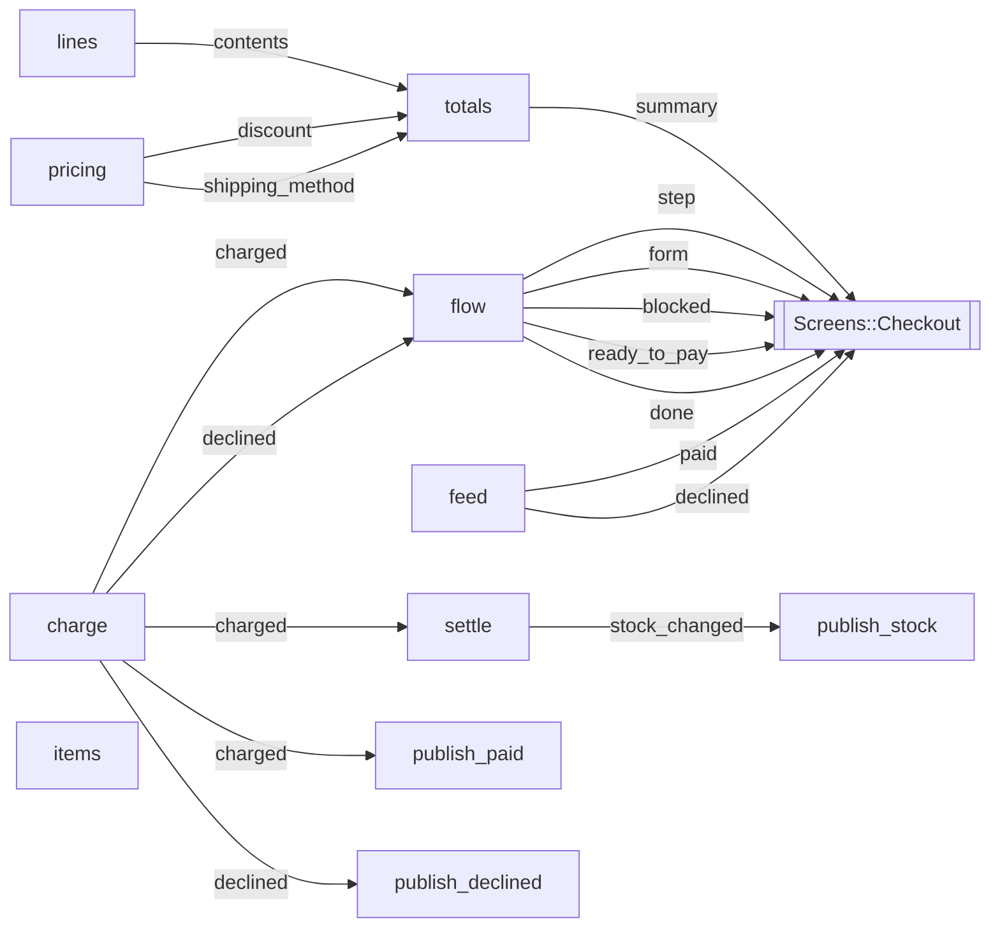

# Screens::Checkout

```mermaid
flowchart LR
  screen[[Screens::Checkout]]
  lines[lines]
  pricing[pricing]
  totals[totals]
  flow[flow]
  charge[charge]
  settle[settle]
  items[items]
  feed[feed]
  publish_stock[publish_stock]
  publish_paid[publish_paid]
  publish_declined[publish_declined]
  lines -- contents --> totals
  pricing -- discount --> totals
  pricing -- shipping_method --> totals
  totals -- summary --> screen
  flow -- step --> screen
  flow -- form --> screen
  flow -- blocked --> screen
  flow -- ready_to_pay --> screen
  flow -- done --> screen
  charge -- charged --> settle
  charge -- charged --> flow
  charge -- charged --> publish_paid
  charge -- declined --> flow
  charge -- declined --> publish_declined
  settle -- stock_changed --> publish_stock
  feed -- paid --> screen
  feed -- declined --> screen
```
