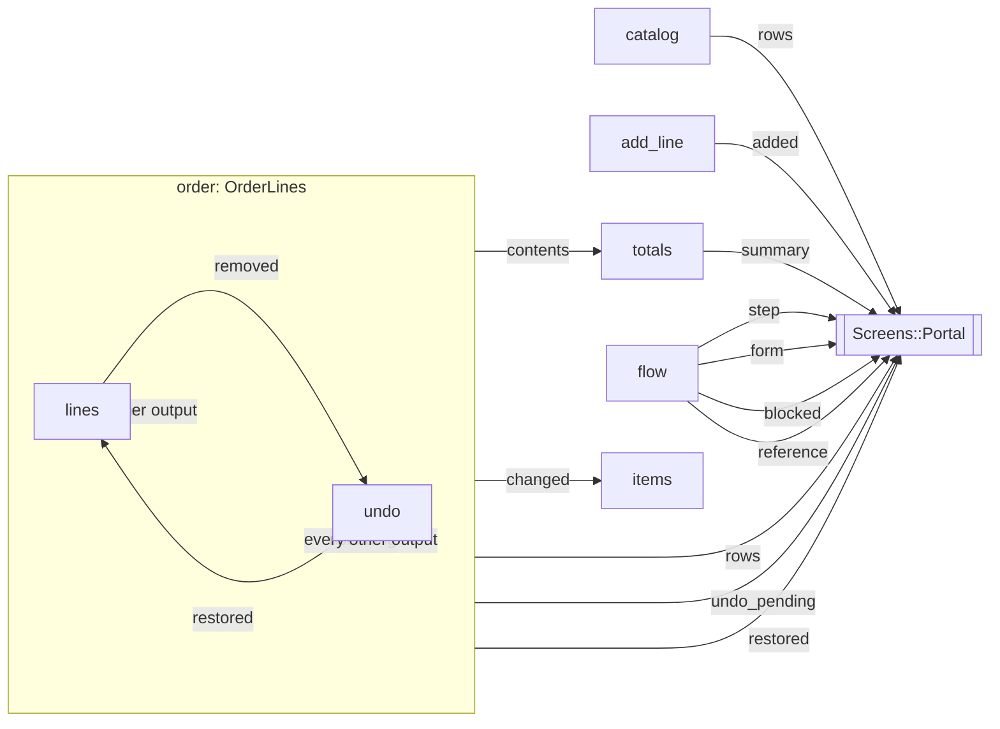

# Screens::Portal

```mermaid
flowchart LR
  screen[[Screens::Portal]]
  subgraph order [order: OrderLines]
  order_lines[lines]
  order_undo[undo]
  end
  catalog[catalog]
  add_line[add_line]
  totals[totals]
  flow[flow]
  items[items]
  order -- changed --> items
  order -- rows --> screen
  order -- contents --> totals
  order -- undo_pending --> screen
  order -- restored --> screen
  catalog -- rows --> screen
  add_line -- added --> screen
  totals -- summary --> screen
  flow -- step --> screen
  flow -- form --> screen
  flow -- blocked --> screen
  flow -- reference --> screen
  order_lines -- removed --> order_undo
  order_undo -- restored --> order_lines
  order_undo -- restored --> order
  order_undo -- pending --> order
  order_lines -- every other output --> order
  order_undo -- every other output --> order
```
