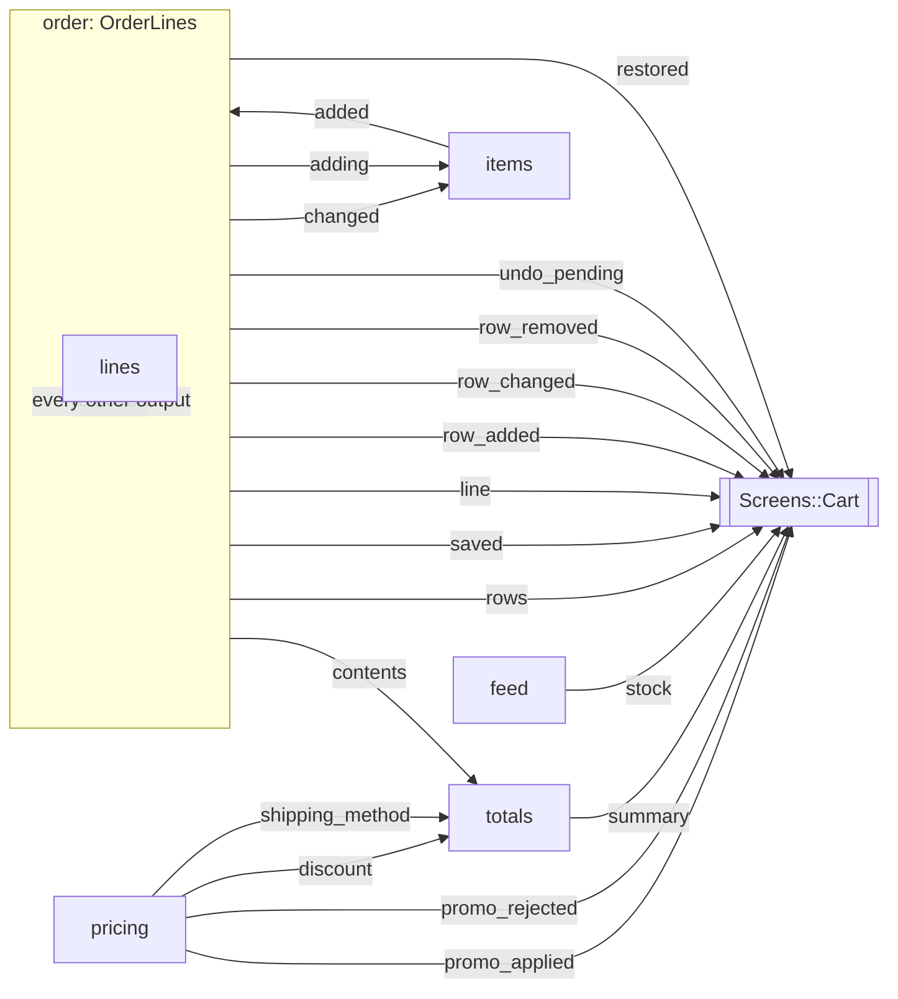

# Screens::Cart

```mermaid
flowchart LR
  screen[[Screens::Cart]]
  subgraph order [order: OrderLines]
  order_lines[lines]
  end
  pricing[pricing]
  totals[totals]
  items[items]
  feed[feed]
  order -- changed --> items
  order -- adding --> items
  items -- added --> order
  order -- rows --> screen
  order -- contents --> totals
  order -- saved --> screen
  order -- line --> screen
  order -- row_added --> screen
  order -- row_changed --> screen
  order -- row_removed --> screen
  order -- undo_pending --> screen
  order -- restored --> screen
  pricing -- discount --> totals
  pricing -- shipping_method --> totals
  pricing -- promo_applied --> screen
  pricing -- promo_rejected --> screen
  totals -- summary --> screen
  feed -- stock --> screen
  order_lines -- removed --> order
  order_lines -- every other output --> order
```
