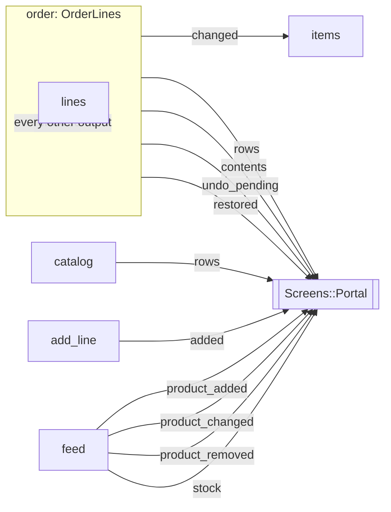

# Screens::Portal

```mermaid
flowchart LR
  screen[[Screens::Portal]]
  subgraph order [order: OrderLines]
  order_lines[lines]
  end
  catalog[catalog]
  add_line[add_line]
  items[items]
  feed[feed]
  order -- changed --> items
  order -- rows --> screen
  order -- contents --> screen
  order -- undo_pending --> screen
  order -- restored --> screen
  catalog -- rows --> screen
  add_line -- added --> screen
  feed -- product_added --> screen
  feed -- product_changed --> screen
  feed -- product_removed --> screen
  feed -- stock --> screen
  order_lines -- removed --> order
  order_lines -- every other output --> order
```
